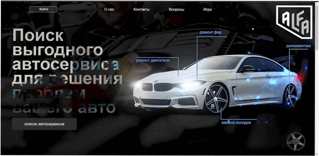

<h1 align="center"> Alpha </h1>

**«Alpha»** - сайт, объединяющий в себе людей, которые хотят найти хороший автосервис, а также автосервисы, заинтересованные в привлечении дополнительных клиентов.

<p align="center">
  
</p>


##  Функционал сайта:

- Регистрация и авторизация автосервиса
- Добавление и удаление услуг, предоставляемых автосервисом
- Живой поиск по названию автосервиса
- Изменение аватарки профиля
- Карта с расположением всех автосервисов

<p align="center">
  
</p>


## Мои задачи: 

- [x] Создание react приложения
- [x] Создание и контроль веток git
- [x] Создание бекенда
- [x] Создание функционала смены аватарки


## Для решения поставленных задач, использовал:

- Node.js, express, multer, MongoDB, prettier - на сервере
- React, react-router-dom, react-hooks, redux, redux-thunk, redux-logger - на клиенте

---

## Команда проекта


<h3>
  <a href="https://github.com/Bilal-1309">
    
  </a>
</h3>

<h3>
  <a href="https://github.com/Amirhad">
    
  </a>
</h3>

<h3>
  <a href="https://github.com/AdamMutaev">
    
  </a>
</h3>

<h3>
  <a href="https://github.com/Iznaur18">
    
  </a>
</h3>

<h3>
  <a href="https://github.com/Viskh">
    
  </a>
</h3>

---


## Запуск проекта

Для запуска проекта вам необходимо набрать команду в терминале:

```javascript
npm i
```

После набрать команду:

```javascript
npm run dev
```

